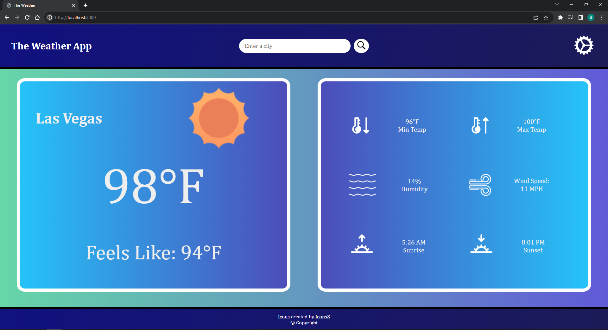

# Weather-Website
 This is a simple Weather Website that uses the OpenWeather API. This web application passes the city chosen by the user to an exprerss server. This server then queries the OpenWeather API to gather data about the weather of the designated city.

Here is screenshot of the web application:
