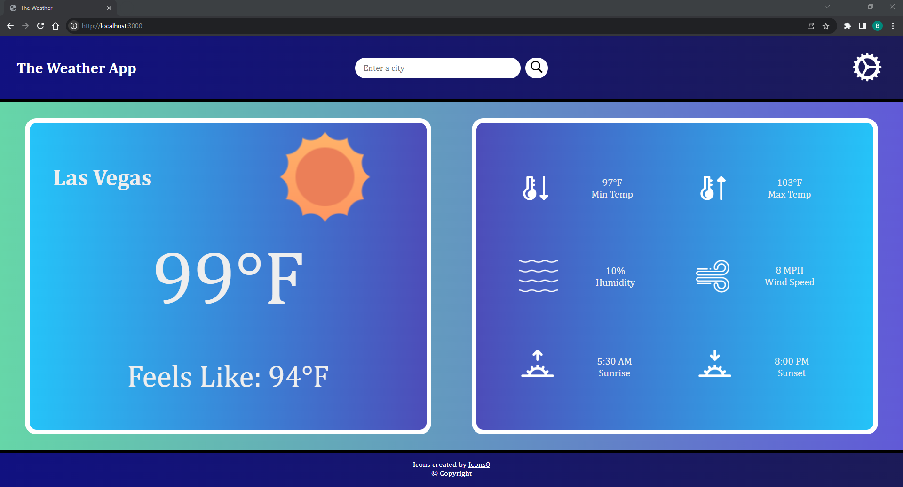

# Weather-Website
 This is a simple Weather Website that uses the OpenWeather API. This web application passes the city chosen by the user to an exprerss server. This server then queries the OpenWeather API to gather data about the weather of the designated city.

Here is a screenshot of the web application:



## How to run
In order to run the application there are only a couple steps:
 1) Download the repository.
 2) Install Node.js if you do not have it already insatlled.
 3) Go to ./weather_website folder in the your download of the repository.
 4) Then run the following command: <br>
    ```npm start```
 5) Lastly, http://localhost:3000 to view it in your browser.

## Tech Stack
This application was build with:
  * Javascript
  * HTML
  * CSS
  * Node.js
  * Express
